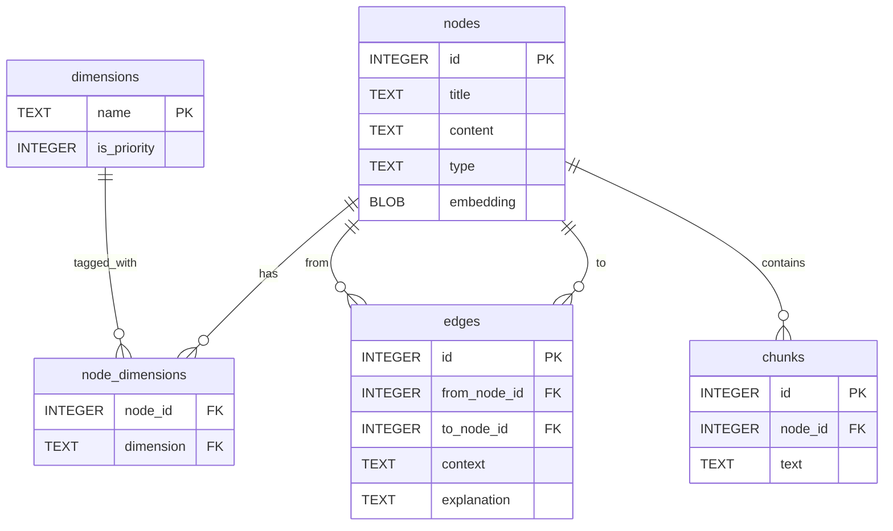

# Database Schema

## Entity Relationship Diagram



---

## Why SQLite?

RA-H uses **SQLite** for local-first data ownership. Your knowledge stays on your machine - no cloud dependencies. SQLite provides:
- **Zero configuration** - single file database
- **sqlite-vec extension** - fast vector similarity search
- **Full-text search (FTS5)** - Google-like text search
- **Relational integrity** - foreign keys, triggers, transactions
- **Portability** - database file migrates with Mac app

**Database Location:** `~/Library/Application Support/RA-H/db/rah.sqlite`

## Two-Layer Embedding Architecture

RA-H uses **two types of embeddings** for different search needs:

### 1. Node-Level Embeddings
- **Storage:** `nodes.embedding` column (BLOB)
- **Purpose:** Semantic search for nodes (legacy memory pipeline used this too)
- **Model:** `text-embedding-3-small` (1536 dimensions)
- **Used by:** Search/agent tools (legacy memory pipeline has been removed)

### 2. Chunk-Level Embeddings
- **Storage:** `chunks` table (text) → `vec_chunks` virtual table (embeddings)
- **Purpose:** Detailed content search within long documents
- **Model:** `text-embedding-3-small` (1536 dimensions)
- **Used by:** `searchContentEmbeddings` tool

## Core Tables

### nodes
Primary knowledge storage. Each row is a discrete knowledge item.

**Columns:**
- `id` (INTEGER PK) - Unique identifier
- `title` (TEXT) - Node title
- `content` (TEXT) - Full content
- `type` (TEXT) - Node type (memory, paper, idea, person, etc)
- `link` (TEXT) - External source URL (only for source nodes, not derived ideas)
- `description` (TEXT) - Brief summary
- `metadata` (TEXT) - JSON metadata
- `chunk` (TEXT) - Source text for chunking
- `chunk_status` (TEXT) - Chunking status (not_chunked, chunked)
- `embedding` (BLOB) - Node-level embedding vector
- `embedding_text` (TEXT) - Text that was embedded
- `embedding_updated_at` (TEXT) - Embedding timestamp
- `is_pinned` (INTEGER) - Legacy pin flag (kept for migration; not surfaced in UI)
- `created_at`, `updated_at` (TEXT) - Timestamps

**Indexes:**
- `idx_nodes_type` - Fast type filtering
- `idx_nodes_pinned` - Legacy partial index (no longer recreated, safe to drop later)

**FTS:**
- `nodes_fts` - Full-text search on title + content

### edges
Directed relationships between nodes (knowledge graph).

**Important behavior:**
- **Storage is directed** (`from_node_id → to_node_id`)
- **UI treats connections as bidirectional** (a node shows edges where it is either `from` or `to`)
- **Every new edge requires an explanation** (enforced in service layer)
- **Every new edge is classified** into a structured `EdgeContext` (stored as JSON)

**Columns (SQLite):**
- `id` (INTEGER PK)
- `from_node_id` (INTEGER FK → nodes.id) — directed “from”
- `to_node_id` (INTEGER FK → nodes.id) — directed “to”
- `source` (TEXT) — creation source (`user`, `helper_name`, `ai_similarity`)
- `created_at` (TEXT)
- `context` (TEXT) — JSON blob (canonical; see `EdgeContext` below)
- `explanation` (TEXT) — legacy column (currently not the canonical source of truth)
- `user_feedback` (INTEGER) — user rating (not currently used in core flows)

**Indexes:**
- `idx_edges_from` — fast “outgoing edges” queries
- `idx_edges_to` — fast “incoming edges” queries

#### EdgeContext (canonical relationship metadata)
Stored as JSON in `edges.context`. This is the “Idea Genealogy” layer.

```typescript
interface EdgeContext {
  // SYSTEM-INFERRED (AI + heuristics classify from explanation + node context)
  category: 'attribution' | 'intellectual';
  type:
    | 'created_by'   // attribution: authorship/creation/founding
    | 'features'     // attribution: appears in / host / guest / explicitly mentioned
    | 'part_of'      // attribution: membership/container (episode→podcast, chapter→book, video→channel)
    | 'source_of'    // intellectual: idea/insight came from source
    | 'extends'      // intellectual: builds on
    | 'supports'     // intellectual: evidence for
    | 'contradicts'  // intellectual: in tension
    | 'related_to';  // intellectual: fallback
  confidence: number;   // 0–1
  inferred_at: string;  // ISO timestamp

  // PROVIDED BY USER/AGENT
  explanation: string;  // required; free-form text (user can edit)

  // SYSTEM-MANAGED
  created_via: 'ui' | 'agent' | 'mcp' | 'workflow' | 'quicklink';
}
```

#### Direction rule (how to write explanations)
Explanations must read correctly **FROM → TO**:
- `created_by`: **FROM** was created/authored/founded by **TO**
- `features`: **FROM** features/mentions **TO**
- `part_of`: **FROM** is part of **TO**
- `source_of`: **FROM** came from / was inspired by **TO**

#### Inference + guardrails
On edge create and on explanation edits, RA-H:
- runs lightweight **heuristics** for common phrases (e.g., “Created by …”, “Part of …”, “Came from …”, “Features …”)
- otherwise runs an AI classification step to populate `category/type/confidence`

The UI also provides 4 quick chips to reduce user cognitive load:
- **Made by** → “Created by …”
- **Part of** → “Part of …”
- **Came from** → “Came from …”
- **Related** → “Related to …”

#### Where edges get created/updated
All edge creation funnels through the service layer enforcement:
- UI (`FocusPanel`) — requires explanation; allows editing explanation (re-infers)
- REST API `POST /api/edges` — requires `explanation`
- Tooling (`createEdge` tool) — requires `explanation`
- MCP (`rah_create_edge`) — requires `explanation`
- Workflows (e.g. `connect`, `integrate`) — call `createEdge` with `explanation`

### chunks
Long-form content split into searchable pieces.

**Columns:**
- `id` (INTEGER PK)
- `node_id` (INTEGER FK → nodes.id)
- `chunk_idx` (INTEGER) - Sequence number
- `text` (TEXT) - Chunk content
- `embedding_type` (TEXT) - Model used
- `metadata` (TEXT) - JSON metadata
- `created_at` (TEXT)

**Indexes:**
- `idx_chunks_by_node` - Fast node→chunks lookup
- `idx_chunks_by_node_idx` - Ordered retrieval

**FTS:**
- `chunks_fts` - Full-text search within chunks

### dimensions
Master list of categorization tags.

**Columns:**
- `name` (TEXT PK) - Dimension name
- `is_priority` (INTEGER) - Priority dimension flag
- `updated_at` (TEXT)

### node_dimensions
Many-to-many junction table (nodes ↔ dimensions).

**Columns:**
- `node_id` (INTEGER FK → nodes.id)
- `dimension` (TEXT FK → dimensions.name)
- Primary key: `(node_id, dimension)`

**Indexes:**
- `idx_dim_by_dimension` - Fast "all nodes in dimension X"
- `idx_dim_by_node` - Fast "all dimensions for node X"

### chats
Conversation history with token/cost tracking.

**Columns:**
- `id` (INTEGER PK)
- `chat_type` (TEXT) - Conversation type
- `helper_name` (TEXT) - Agent key (ra-h, ra-h-easy, mini-rah, wise-rah)
- `agent_type` (TEXT) - Role category (orchestrator, executor, planner)
- `delegation_id` (INTEGER FK)
- `user_message` (TEXT)
- `assistant_message` (TEXT)
- `thread_id` (TEXT) - Conversation thread
- `focused_node_id` (INTEGER FK → nodes.id)
- `metadata` (TEXT) - JSON with token counts, costs, traces
- `created_at` (TEXT)

**Indexes:**
- `idx_chats_thread` - Fast thread retrieval

### agent_delegations
Task queue for mini-rah workers.

**Columns:**
- `id` (INTEGER PK)
- `session_id` (TEXT UNIQUE) - Delegation identifier
- `agent_type` (TEXT) - Delegate type (default: 'mini')
- `task` (TEXT) - Task description
- `context` (TEXT) - Execution context
- `expected_outcome` (TEXT)
- `status` (TEXT) - queued, in_progress, completed, failed
- `summary` (TEXT) - Result summary
- `created_at`, `updated_at` (TEXT)

### chat_memory_state
Checkpoint tracker for memory pipeline.

**Columns:**
- `thread_id` (TEXT PK)
- `helper_name` (TEXT) - Agent that owns the thread
- `last_processed_chat_id` (INTEGER) - Last chat processed
- `last_processed_at` (TEXT)

**Indexes:**
- `idx_chat_memory_thread` - Fast state lookup

### logs
Activity audit trail (auto-pruned to last 10k).

**Columns:**
- `id` (INTEGER PK)
- `ts` (TEXT) - Timestamp
- `table_name` (TEXT) - Affected table
- `action` (TEXT) - INSERT, UPDATE, DELETE
- `row_id` (INTEGER) - Affected row
- `summary` (TEXT) - Human-readable summary
- `snapshot_json` (TEXT) - Row snapshot
- `enriched_summary` (TEXT) - Enriched log entry

**Indexes:**
- `idx_logs_ts` - Chronological queries
- `idx_logs_table_ts` - Per-table chronological
- `idx_logs_table_row` - Per-row history
- `idx_logs_enriched` - Enriched-only filtering

## Vector Tables (Auto-Created)

### vec_nodes
Virtual table for node-level vector search (sqlite-vec).

```sql
VIRTUAL TABLE USING vec0(
  node_id INTEGER PRIMARY KEY,
  embedding FLOAT[1536]
)
```

**Supporting tables (auto-generated):**
- `vec_nodes_info`, `vec_nodes_chunks`, `vec_nodes_rowids`, `vec_nodes_vector_chunks00`

### vec_chunks
Virtual table for chunk-level vector search.

```sql
VIRTUAL TABLE USING vec0(
  chunk_id INTEGER PRIMARY KEY,
  embedding FLOAT[1536]
)
```

**Supporting tables (auto-generated):**
- `vec_chunks_info`, `vec_chunks_chunks`, `vec_chunks_rowids`, `vec_chunks_vector_chunks00`

**Note:** Vec tables are NOT pre-seeded in distribution. They auto-create on first app startup via `ensureVectorTables()` in `sqlite-client.ts:45`.

## Views

### nodes_v
Nodes with dimensions aggregated as JSON array.

```sql
SELECT 
  n.id, n.title, n.content, n.link, n.metadata, n.chunk,
  n.created_at, n.updated_at,
  COALESCE(JSON_GROUP_ARRAY(d.dimension), '[]') AS dimensions_json
FROM nodes n
LEFT JOIN node_dimensions d ON d.node_id = n.id
```

### logs_v
Enriched logs with related data (node titles, edge titles, chat previews).

## Triggers

**Logging triggers:**
- `trg_nodes_ai` / `trg_nodes_au` - Log node inserts/updates
- `trg_edges_ai` / `trg_edges_au` - Log edge inserts/updates
- `trg_chats_ai` - Log chat inserts (with token/cost/trace metadata)

**Maintenance triggers:**
- `trg_edges_update_nodes_on_insert` - Touch node timestamps on edge creation
- `trg_logs_prune` - Keep last 10,000 log rows

## Schema Version

**schema_version table:**
- Tracks database migrations
- Current: v1.0 (frozen for Mac app release)

```sql
CREATE TABLE schema_version (
  version INTEGER PRIMARY KEY,
  applied_at TEXT DEFAULT CURRENT_TIMESTAMP,
  description TEXT
);
```

## Seed Database

**Location:** `/dist/resources/rah_seed.sqlite`  
**Purpose:** Ships with Mac app for new users  
**Contents:** Clean schema, no data, no vec tables (auto-created on first run)  
**Size:** ~128KB
